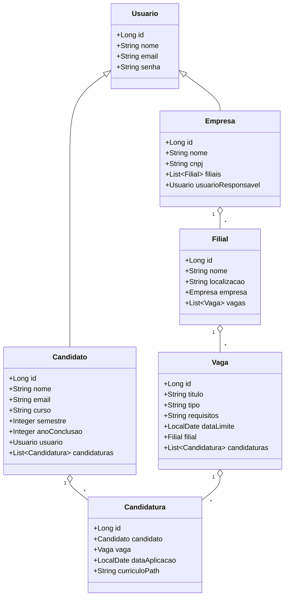

```mermaid
classDiagram

class Usuario {
  +Long id
  +String nome
  +String email
  +String senha
}

class Empresa {
  +Long id
  +String nome
  +String cnpj
  +List~Filial~ filiais
  +Usuario usuarioResponsavel
}

class Filial {
  +Long id
  +String nome
  +String localizacao
  +Empresa empresa
  +List~Vaga~ vagas
}

class Candidato {
  +Long id
  +String nome
  +String email
  +String curso
  +Integer semestre
  +Integer anoConclusao
  +Usuario usuario
  +List~Candidatura~ candidaturas
}

class Vaga {
  +Long id
  +String titulo
  +String tipo
  +String requisitos
  +LocalDate dataLimite
  +Filial filial
  +List~Candidatura~ candidaturas
}

class Candidatura {
  +Long id
  +Candidato candidato
  +Vaga vaga
  +LocalDate dataAplicacao
  +String curriculoPath
}

Usuario <|-- Candidato
Usuario <|-- Empresa
Empresa "1" o-- "*" Filial
Filial "1" o-- "*" Vaga
Candidato "1" o-- "*" Candidatura
Vaga "1" o-- "*" Candidatura
```
